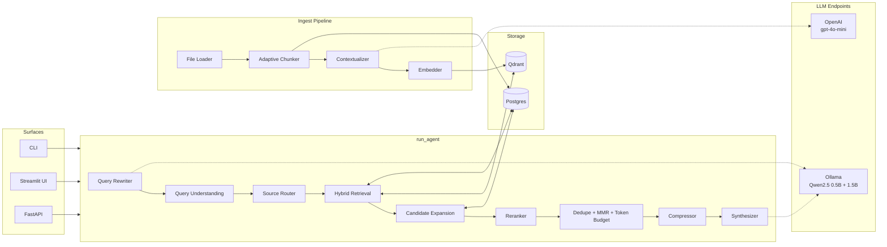

# Betopia RAG — Architecture

```mermaid
flowchart LR
  subgraph Surfaces
    CLI[CLI]
    UI[Streamlit UI]
    API[FastAPI]
  end

  subgraph Agent[run_agent]
    direction TB
    REW[Query Rewriter]
    UND[Query Understanding]
    ROUT[Source Router]
    HYB[Hybrid Retrieval]
    EXP[Candidate Expansion]
    RER[Reranker]
    DED[Dedupe + MMR + Token Budget]
    COM[Compressor]
    SYN[Synthesizer]
    REW --> UND --> ROUT --> HYB --> EXP --> RER --> DED --> COM --> SYN
  end

  subgraph Ingest[Ingest Pipeline]
    direction TB
    LOAD[File Loader]
    CHUNK[Adaptive Chunker]
    CTX[Contextualizer]
    EMBED[Embedder]
    LOAD --> CHUNK --> CTX --> EMBED
  end

  subgraph Stores[Storage]
    QD[(Qdrant)]
    PG[(Postgres)]
  end

  subgraph LLMs[LLM Endpoints]
    OLL[Ollama<br/>Qwen2.5 0.5B + 1.5B]
    OAI[OpenAI<br/>gpt-4o-mini]
  end

  CLI --> Agent
  UI --> Agent
  API --> Agent

  HYB <--> QD
  HYB <--> PG
  EXP <--> PG

  REW -.-> OLL
  SYN -.-> OLL
  CTX -.-> OAI

  EMBED --> QD
  CHUNK --> PG
```
